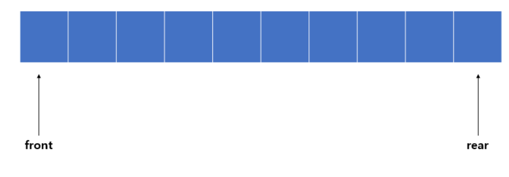

# 큐 란

- FIFO 를 원칙하에 운용되는 자료 구조 - 스택과 상반되는 순서를 가짐
  - key-value의 구주로 사용할수 있으며 key 값을 통해 o(1)시간으로 접근할수있다
  - front 와 rear라는 용어는 각각 큐에서 가장 처음의 원소 front , 가장 마지막 원소 rear라고 볼수있다
  - stack 과 다르게 객체로 구현하는것이 유리하다
    
