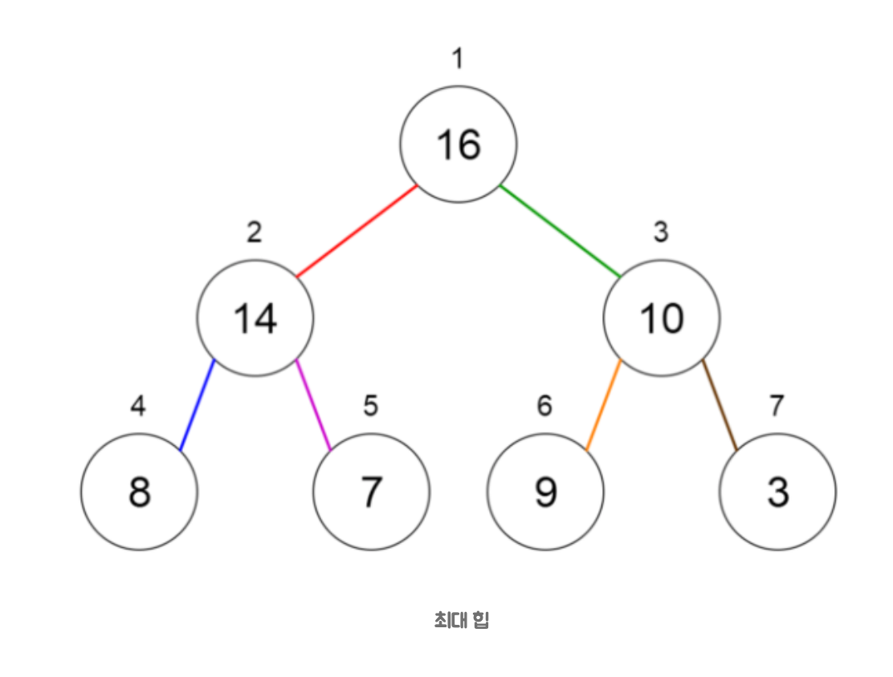
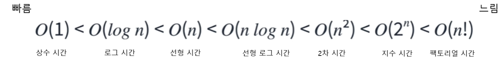

# 01. 자료구조(Data Structure)

- 데이터를 효율적으로 다룰수 잇게 도와주는 데이터 보관방법 , 데이터에 관한 연산의 총제
- 자료구조의 형식
  - 단순 자료구조
  - 복합 자료 구조
- 단순 자료 구조
  - int , long ,double
- 복합 자료 구조
  - 선형(Linear)
    - 배열 (Array)
    - 연결 리스트 (Linked List)
    - 스택 (Stack)
    - 큐 (Queue)
    - 힙 (Heap)
  - 비션형 (Non-Linear)
    - 트리 (Tree)
    - 그래프 (Graph)

## 주요 자료 구조

1. 배열 (Array)
2. 연결 리스트 (Linked List)
3. 스택 (Stack)
4. 큐 (Queue)
5. 해시 테이블 (Hash Table)
6. 트리 (Tree)
7. 그래프 (Graph)
8. 집합 (Set)
9. 힙 (Heap)

## 선형 구조

- 선형 구조는 한 원소 뒤에 하나의 원소만이 존재하는 형태로 자료들이 선형으로 나열되어 있는 구조를 가진다

---

### 배열

> 연관된 data를 메모리상에 연속적이며 순차적으로 미리 할당된 크기만큼 저장하는 자료 구조

- 동일한 타입의 데이터들을 저장하여 고정된 크기를 가지고 있다
- 인덱싱이 되어 있어 인덱스 번호로 데이터를 접근할수있다

_사용 예시_

- 주식차트

#### 시간 복잡도

- O(1)
  - access , append , 마지막 원소 delete
- O(n)
  - insertion , deletion , search

#### 분류

- 단순 연결 리스트
- 이중 연결 리스트
- 원형 연결 리스트

#### 주의 사항

- size를 넘는 양의 데이터 처리
  - Dynamic Array(동적배열)
    - 기존사이즈 보다 더큰 array 를 선언후 데이터를 옮김 (기존 array 삭제)
  - Array 대신 Linked List 사용
- Size 예측이 어려운 경우
  - 데이터가 추가될때 매다 메모리 공간을 할당

### Dynamic Array

> resize를 통해 유동적으로 size를 조절하여 데이터를 저장하는 자료구조

- Array 의 fixed-size의 문제를 보완하기 위해 고안

#### doubling

- resize의 대표적인 방법 , 기존 배열의 size를 2배 큰배열로 선언후 데이터를 옮기는 방식

#### 시간 복잡도

- O(1)
  - 데이터 추가 및 대부분의 작업
- O(n)
  - 특정 size 를 resize가 일어날때

### 연결 리스트

> 각 요소가 다음 요소의 참조를 포함하는 노드 형태로 구성된 자료구조

- 각 데이터 시퀀스가 순서를 가지고 연결된 순차적 구조
- 동적인 데이터 추가/삭제에 유리하다

_사용 예시_

- 프로그램 간 전환
- 갤러리

### 스택

> LIFO(Last In First Out) 방식으로 작동하는 자료구조

- 순서가 보존되는 선형 데이터 구조
- 가장 마지막 요소(가장최근요소) 부터 처리한다(삭제포함)

_사용 예시_

- 실행 취소
- 수학적 표현식을 구문 분석하고 평가
- 재귀 프로그래밍에서 함수 호출을 구현

### 큐

> FIFO(First In First Out) 방식으로 작동하는 자료구조

_사용 예시_

- 멀티스레딩에서 스레드 관리
- 대기열 시스템

### 힙

> 완전 이진 트리의 일종으로, 부모 노드가 자식 노드보다 크거나 작아야 하는 특성을 가진 자료구조

- 최소 힙 : 부모의 키값이 자식의 키값보다 작거나 같다

  - 루트 노드의 키 값이 트리의 최솟값

- 최대 힙 : 부모의 키 값이 자식의 키 값보다 크거나 같다
  - 루트 노드의 키 값이 트리의 최댓값
    

_사용 예시_

- 힙 정렬 알고리즘
- 우선순위 큐

### 해시 테이블

> 키(key)를 이용해 데이터를 빠르게 찾을 수 있는 자료구조

- 해시함수를 사용하여 변환한 값을 색인(index)로 삼아 키(key)와 데어터(valu)를 저장하는 자료구조
- 데이터 크기와 관계없이 삽입 및 검색에 매우 효율적

_주의점_
보통 테이블 내 더작은 서브 그룹인 버킷(bucket)에 키/값(key/value) 쌍을 저장

단 , 충돌이 자주일어날수있어 이를 보안하는방법으로는

- 해시 함수 개선 , 해시 테이블 구조 개선 (chaining, open addressing 등)의 방법이 사용된다

_사용 예시_

- 데이터 베이스 인덱스 구현
- 사용자 로그인 인증(캐시 시스템)
- 객체 저장

## 비션형 구조

- 비선형 구조는 원소 간 다대다 관계를 가지는 구조로 계층적 구조나 망형 구조를 표현하기에 적절

---

### 트리

> 계층적인 구조를 가지며, 부모-자식 관계를 갖는 노드들로 구성된 자료구조

- 그래프가 계층적 구조를 가진 형태
- 최상위 노드(루트)를 가지고 있음
- 상위 노드를 부모노드 , 하위 노드를 자식 노드라 한다

_사용 예시_

- 디렉터리 구조
- DOM 트리
- 이진 검색 트리 (Binary Search Trees)

#### 분류

- 일반 트리
- 이진 트리

### 그래프

> 정점(Vertex)과 간선(Edge)으로 이루어진 자료구조

- nodes/vertices(노드) 사이에 edge(엣지)가 있는 collection
- directed(방향) 그래프는 일반통행
- undirected(무방향) 그래프는 양방향

_사용 예시_

- 소셜 미디어 네트워크를 나타내는 데 사용
- 검색 엔진에 의해 웹 페이지 및 링크를 나타내는 데 사용
- GPS에서 위치와 경로를 나타내는데 사용

#### 분류

- 방향 그래프
- 무방향 그래프

## 시간 복잡도란

> 프로그램의 대략적인 성능을 비교하기 위한 상대적인 표기법

### Big-O 표기법

> 시간 복잡도를 나타내기 위한 방법 중 하나

#### 표기방식

1. 상수항은 무시
   빅오 표기법은 데이터 입력값(n)이 충분히 크다고 가정하고 있고, 알고리즘의 효율성 또한 데이터 입력값(n)의 크기에 따라 영향을 받기 때문에 상수항 같은 사소한 부분은 무시

2. 가장 큰 항 외엔 무시
   빅오 표기법은 데이터 입력값(n)의 크기에 따라 영향을 받기 때문에 가장 영향력이 큰 항에 이외에 영향력이 없는 항들은 무시한다.

- 추가적인 JavaScript 성능측정
  - Date 객체 사용
