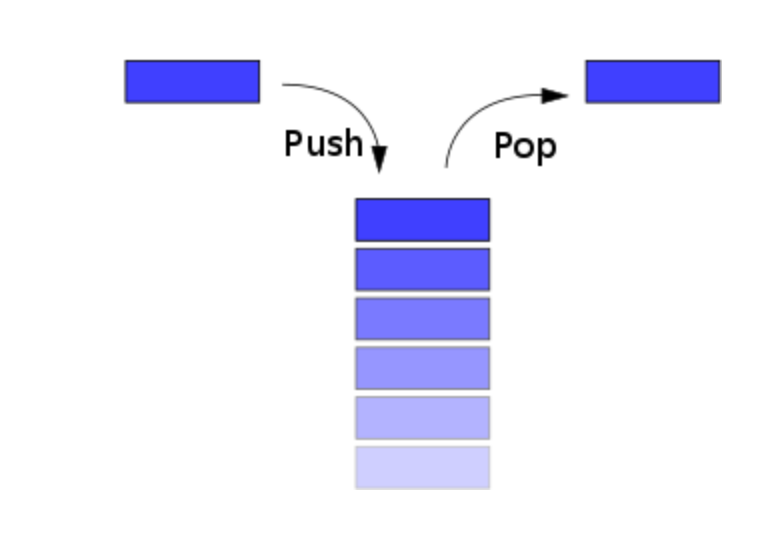

# 스택이 무엇인지

- Js에서의 모든함수 호출 이 스택자료 구조로 되어있는데
  
- 위 그림과 같이 한줄로 탑같이 쌓는 형태의 자료 구조를 말한다
  - 맨위에 데이터를 하나씩 추가하는것을 push
  - 맨위부터 데이터를 하나씩 제거하는것을 pop 이라고 한다
  - 위과정처럼 데이터를 처리하는과정을 LIFO 구조라고 합니다

### 사용예시

- 웹 브라우저의 뒤로가기 기능
- 실행 취소

# js 로 스텍을 구현하는 방법

Ch-02/02-03/Array/Array.js

## Array 로 구현하는 방법

Ch-02/02-03/LinkedList/LinkedList.js

## 가능하면 연결리스트로 스텍을 구현하는방법
