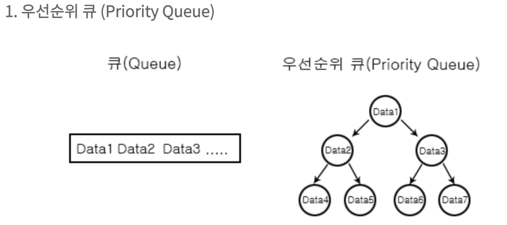
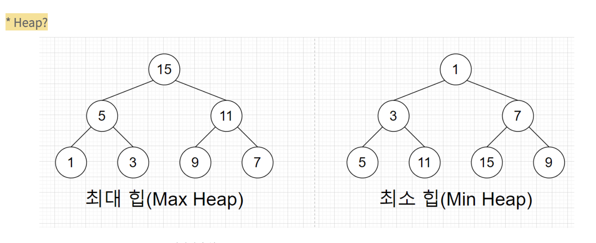

# 우선순위 큐

- 우선순위가 가장 높은 데이터를 가장 먼저 삭제하는 자료구조
- 우선순위 큐는 데이터를 우선순위에 따라 처리하고 싶을 때 사용한다.
  

## 특징

- 우선순위 기반 처리 : 높은 우선순위를 가진 요소가 먼저 처리됨
- 삽입과 삭제 : 요소를 삽입하고, 우선순위가 높은 요소를 빠르게 제거할 수 있어야됨

### 구현

- 배열 및 연결리스트로 구현

  - 간단한 구현이 가능하는 장점에 비해 모든 인덱스를 탐색하여야 과정으로 시간복잡도 O(N) 으로 상대적으로 부족한 성능

- 힙(Heap)으로 구현

  - 상대적으로 구현이 어렵지만 시간 복잡도가 O(log n) 이므로 좋은 성능을 보임

### 힙의 특징

- 완전 이진 트리 자료구조
- 최소힙
  - 루트 노드가 가장 작은 값을 가지며 값이 작은 데이터가 우선적으로 제거된다.
  - 최소 힙은 부모노드가 항상 자식노드보다 값이 작다.
- 최대힙
  - 루트 노드가 가장 큰 값을 가지며 값이 큰 데이터가 우선적으로 제거된다.
  - 최대 힙은 부모노드가 항상 자식노드보다 값이 크다.
    
