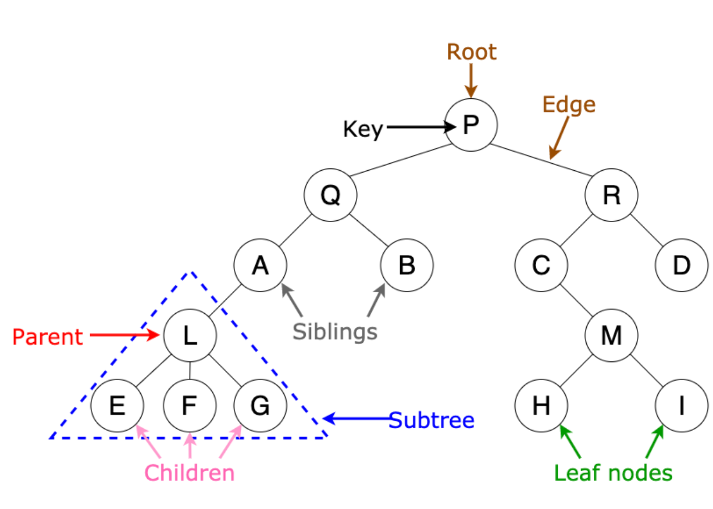
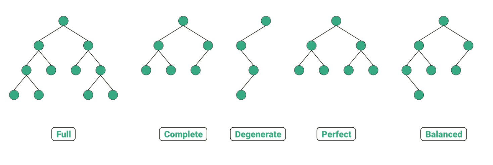

# Tree

- 부모-자식 관계를 가지며 비선형 데이터 구조이다

### 구성요소

- 노드(Node) : 트리의 구성요소 , 데이터를 저장하는 단위

  - 루트(Root) : 트리의 최상단 노드. 부모가 없는 유일한 노드.
  - 부모 노드(Parent Node) : 자식 노드를 가진 노드.
  - 자식 노드(Child Node) : 특정 부모를 가진 노드.
  - 리프(Leaf) : 자식이 없는 노드 (끝 노드).
  - 형제(Sibling) : 같은 부모를 가진 노드들.

- 간선(Edge) : 두 노드를 연결하는 링크
- 레벨(Level) : 루트에서 해당 노드까지의 경로의 길이
- 높이(Height) : 루트에서 가장 기픙ㄴ 노드까지의 길이
  

### 사용 위치

- 파일 시스템
- HTML DOM
- 데이터베이스 쿼리
- React 컴포넌트

## 이진 트리

- 트리 구조중 특수한 경우로 , 자식 노드가 두개인 트리를 뜻합니다 - 이진 트리는 자료의 삽입 , 삭제 방법따라 여러가지이름으로 나뉩니다

### 분류

- 정 이진 트리(Full binary tree)
  - 각 노드가 0 개 혹은 2 개의 자식 노드를 갖는 경우
- 완전 이진 트리(Complete binary tree)
  - 마지막 레벨을 제외한 모든 노드가 가득 차 있어야 하고, 마지막 레벨의 노드는 전부 차 있지 않아도 되지만 왼쪽이 채워져 있는 경우
- 포화 이진 트리(Perfect binary tree)
  - 정 이진 트리이면서 완전 이진 트리인 경우. 모든 리프 노드의 레벨이 동일하고, 모든 레벨이 가득 채워져 있는경우

## 트리 순회 알고리즘

- 특정 목적을 위해 트리의 모든 노드를 한 번씩 방문하는 것
  - 트리를 순회할 때에는 항상 왼쪽이 우선

#### 순회방법

- 전위 순회
  - 루트에서 시작해 왼쪽의 노드들을 순차적으로 둘러본 뒤, 왼쪽의 노드 탐색이 끝나면 오른쪽 노드를 탐색을 하는 방식
- 중위 순회
  - 제일 왼쪽 끝에 있는 노드부터 순회하기 시작하여, 루트를 기준으로 왼쪽에 있는 노드의 순회가 끝나면 루트를 거쳐 오른쪽에 있는 노드로 이동하여 마저 탐색하는 방식
- 후위 순회
  - 제일 왼쪽 끝에 있는 노드부터 순회하기 시작하여, 루트를 거치지 않고 오른쪽으로 이동해 순회한 뒤, 제일 마지막에 루트를 방문하는 방식
