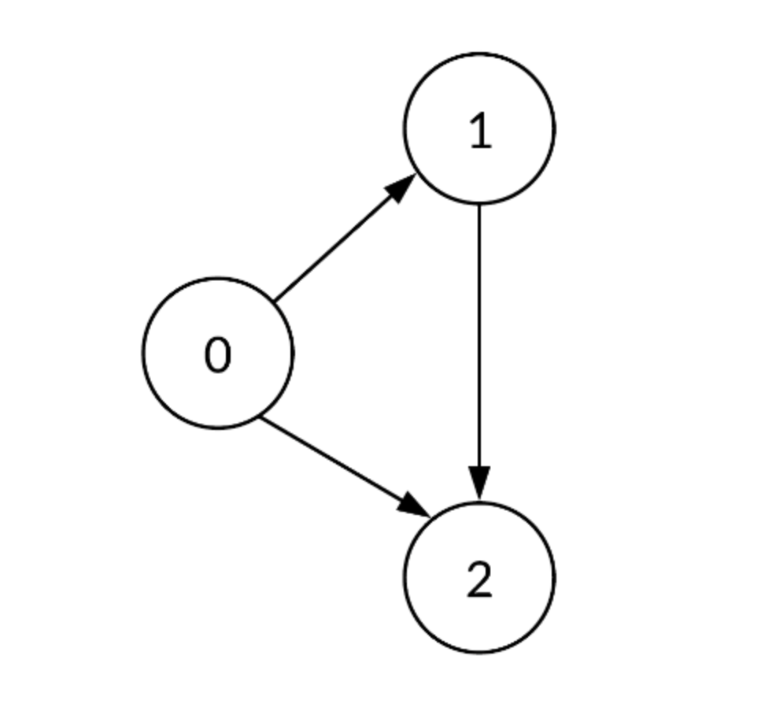
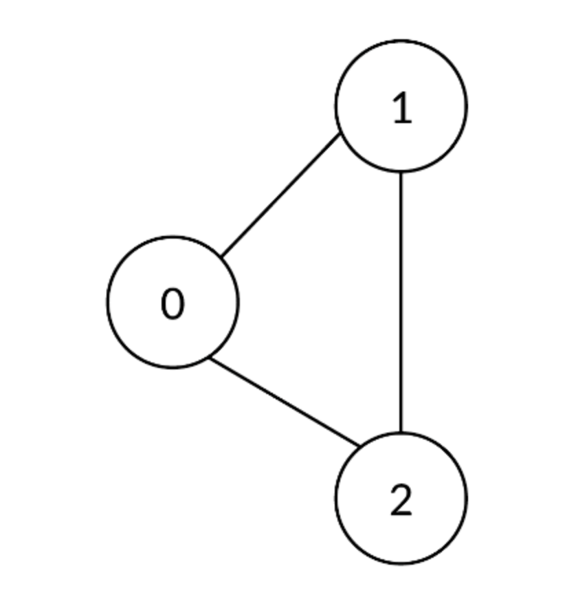
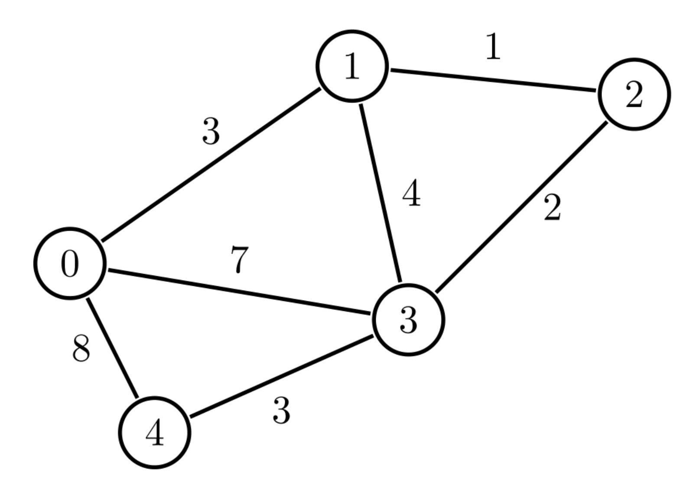
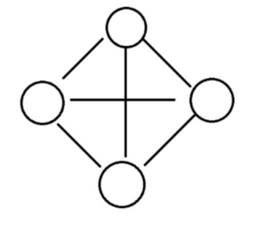
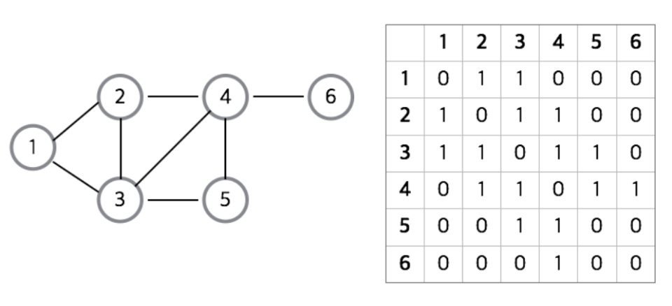
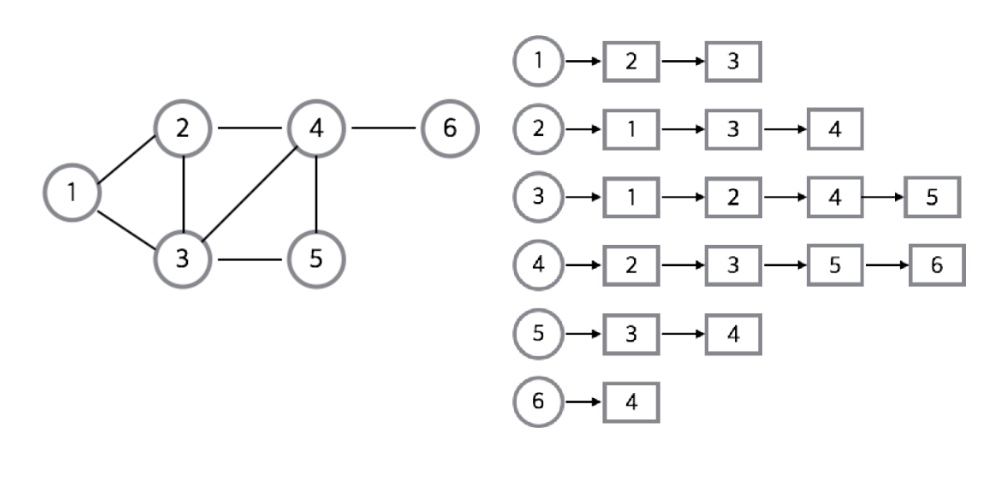

# Graph

- 정점 , 간선 의 집합으로 이루어진 비선형 자료구조
- 그래프(Graph)와 트리(Tree)는 정점의 관계를 표현하는 자료구조
- 네트워크 , 소셜 미디어 관계 , 지도 경료 탐색등 에서 활용

### 구성요소

- 정점(Vertex) : 노드(node)라고도 불리며, 데이터를 담는 개체입니다.
- 간선(Edge) : 링크(arcs)라고도 하며, 정점 간의 연결을 의미합니다. 방향성이 있는 경우도 있고, 없는 경우도 있습니다.

## 그래프의 종류

- 단반향 그래프(Directed Graph) : 간선이 특정 방향을 가짐 , 정점을 연결하는 간선에 방향이 없는 그래프를 말한다

  

- 무방향 그래프(Undirected Graph) : 간선에 방향이 없음.

  

- 가중치 그래프(Weighted Graph) : 두 정점을 이동하는 비용이 존재하는 그래프
  - 간선에 값(예: 거리, 비용 등)이 부여된 그래프
    
- 완전 그래프(Completed Graph) : 모든 정점이 연결되어있는 그래프

  

## 구현 방법

- 인접행렬
- 인접리스트

### 인접행렬

    - 2차원 배열에 각 정점이 연결된 형태를 표현하는 방식이다.

#### 장점

- 2차원 배열 안에 모든 정점들의 간선 정보를 담기 때문에 배열의 위치를 확인하면 두 점에 대한 연결 정보를 조회할 때 O(1) 의 시간 복잡도면 가능합니다.
- 구현이 비교적 간편

#### 단점

- 모든 정점에 대해 간선 정보를 대입해야 하므로 O(n²) 의 시간복잡도가 소요됩니다.
- 무조건 2차원 배열이 필요하기에 필요 이상의 공간이 낭비됩니다.

### 인접 리스트

- 그래프의 노드들을 리스트로 표현한것입니다.
- 정점의 리스트 배열을 만들어 관계를 설정해줌
  

#### 장점

- 정점들의 연결 정보를 탐색할 때 O(n) 의 시간이면 가능합니다. (n: 간선의 갯수)
- 필요한 만큼의 공간만 사용하기때문에 공간의 낭비가 적습니다.

#### 단점

- 특정 두 점이 연결되었는지 확인하려면 인접행렬에 비해 시간이 오래 걸립니다. (배열보다 검색 속도느림)
- 구현이 비교적 어렵습니다.

## 탐색

### 깊이 우선 탐색(Depth-First Search)

> 그래프의 가장 깊은 곳 까지 내려간 후, 더 이상 내려갈 정점이 없으면 옆으로 이동하는 탐색 기법

- 재귀 호출
- 스택(Stack)

### 너비 우선 탐색(Breadth-First Search)

> 그래프에서 최대한 넓게 이동한 후, 더 이상 이동할 정점이 없으면 내려가는 탐색 기법

- 큐(Queue)
