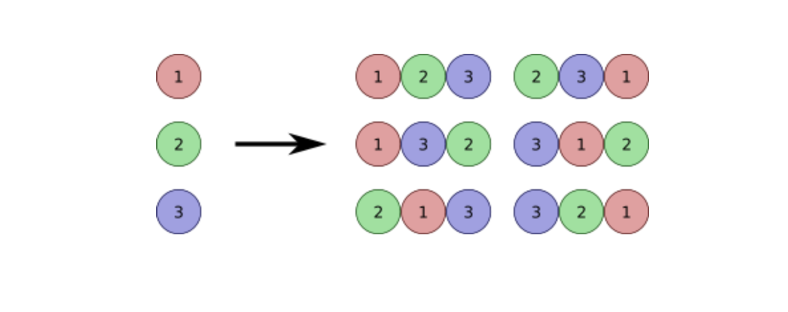

# {순열}

## 요약 설명

서로 다른 n개의 물건 중에서 r개를 택하여 한 줄로 배열하는 것을 n개의 물건에서 r개 택하는 순열을 의미합니다.
예를 들어 사진과 같이 , 숫자 1, 2, 3의 순열은 1-2-3, 1-3-2, 2-1-3, 2-3-1, 3-1-2, 3-2-1 등 총 6가지가 있습니다.
 

## 언제 사용하면 좋은가?

1. 경우의 수를 모두 나열하고자 할 때: 특정 조건을 만족하는 모든 가능한 조합을 찾는경우
2. 순서가 중요한 문제에서: 예를 들어, 비밀번호 생성, 경로 탐색 문제 등에서 순열을 이용해 모든 경우를 탐색할 수 있습니다.
    

## 어떻게 구현할까?

> [보러가기 > _cd ./implements.js_](https://github.com/keeprok/MOZARAM/)

> [실행해보기 > _node ./implements.js_](https://www.typescriptlang.org/play/?#code/Q)

 

## 추천 문제

- [_백준 > 문제번호_](https://url)
- [_프로그래머스 > 문제번호_](https://url)

 
