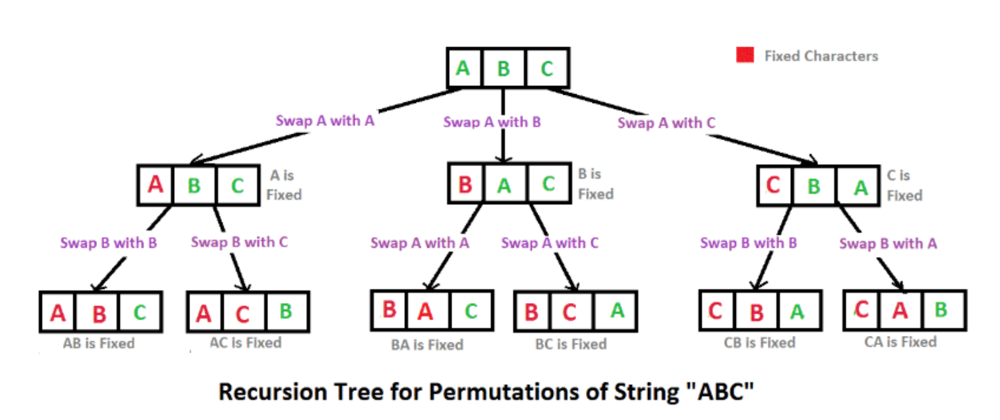

# {조합}

## 요약 설명

앞선 설명과 다르게 특정 개수의 원소를 순서와 상관없이 선택하는 것을 의미

> 1,2,3 -> [1, 2], [1, 3], [2, 3] => [1, 2] = [2, 1] >

 

## 언제 사용하면 좋은가?

1. 순서가 중요하지 않은 경우: 예를 들어, 복권 번호 추첨, 팀 구성, 물건 선택 문제 등
2. 모든 경우의 수를 탐색해야 하지만 순서가 중요하지 않은 문제에서 유용
    
   

## 어떻게 구현할까?

> [보러가기 > _cd ./implements.js_](https://github.com/keeprok/MOZARAM/)

> [실행해보기 > _node ./implements.js_](https://www.typescriptlang.org/play/?#code/Q)

 

## 추천 문제

- [_백준 > 문제번호_](https://url)
- [_프로그래머스 > 문제번호_](https://url)

 
